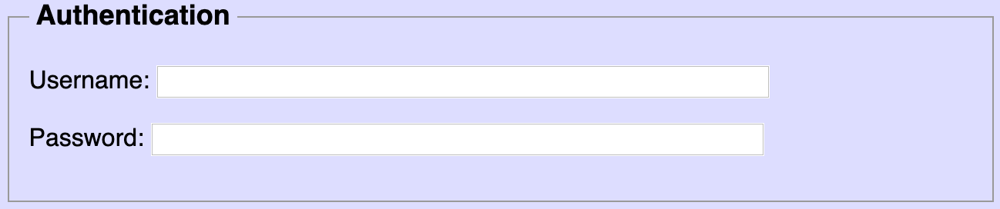
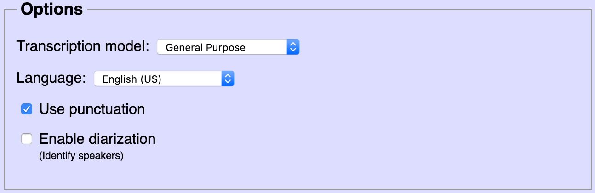
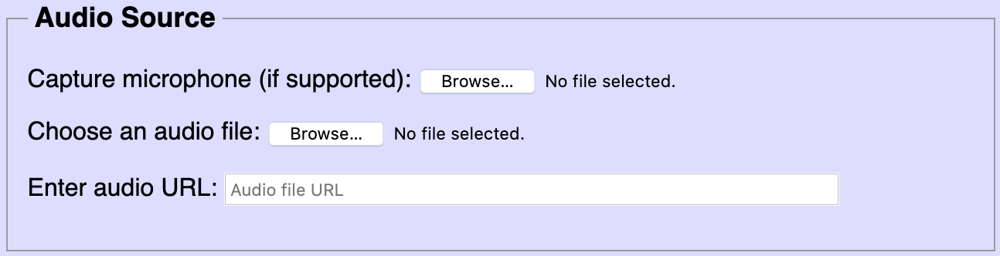
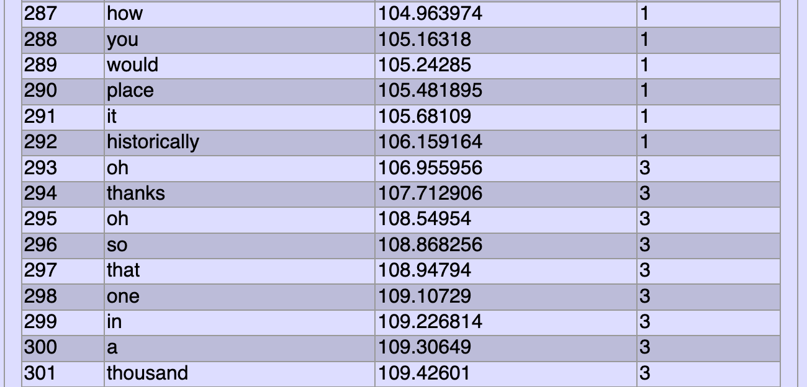

# Introduction to Deepgram API Options

The [Deepgram API](https://docs.deepgram.com) provides the ability to obtain not only simple transcriptions of the spoken contents of an audio file or stream, but also supports options you can use to configure the speech recognition process to provide additional information, detect when different speakers are talking, and so forth.

In this tutorial, we’ll examine how to customize some of the API’s options to improve recognition given your audio source, the speaker’s language, and to support multi-speaker recordings.

To begin with, you’ll need API credentials. For this tutorial, we’ll be using a username and password, but you can also [obtain an API key](https://enterprise.deepgram.com/) that can be used instead, which is more secure, especially for web apps that you intend to distribute. It’s better to share an API key with the world than a username and password!

The speech recognition API is available at `https://brain.deepgram.com/v2/listen`. Simply use HTTP to [POST](https://developer.mozilla.org/en-US/docs/Web/HTTP/Methods/POST) requests to that address. [Details on the API](https://docs.deepgram.com/#speech-recognition) are available in the Deepgram documentation.

While the JavaScript for this example is included in this article, the HTML and CSS is not, other than a few key snippets. You can, however, [obtain the complete code](https://github.com/a2sheppy/deepgram-tutorial) for this example on GitHub.

One good approach to this example is to try it out in your browser first, before reading more about how it works. This will let you experiment with the options supported by the example. With that in mind, before getting into how the example’s code works, let’s look at how to use it.

## Running the Example

Because this example involves issuing HTTPS requests to a remote server, many or all modern browsers won’t let you test this code using a `file:///` URL. Instead, you’ll need to run a local web server, or post the example online, in order to test it out.

If you don't have a local web server already available and have Python installed, an easy way to do this is to create a script called `simple-https-server.py`, with the following code:

```python
import BaseHTTPServer, SimpleHTTPServer
import ssl

httpd = BaseHTTPServer.HTTPServer(('localhost', 4443),
            SimpleHTTPServer.SimpleHTTPRequestHandler)
httpd.socket = ssl.wrap_socket (httpd.socket,
            certfile='./server.pem', server_side=True)
httpd.serve_forever()
```

Then create a certificate file named `server.pem` using OpenSSL:

```bash
openssl req -new -x509 -keyout server.pem -out server.pem -days 365 -nodes
```

You can then start up the local web server by running the `simple-https-server.py` script from within the directory containing the example’s files.

```bash
python simple-https-server.py
```

With the simple web server running, use your web browser to go to [https://localhost:4443](https://localhost:4443) to view the example and experiment with the API’s options.

## Using the Example

The example web application itself presents its interface using a set of boxes. Go ahead, experiment and try them all out. The following subsections describe each box's contents, including what each configuration option does in general.

### Authentication



There are two edit fields in the authentication settings box, for the username and password of a [Deepgram enterprise API account](https://enterprise.deepgram.com/). These are required, and will be used when connecting to the server to gain access.

### Options



The Options box provides controls to let you configure how the speech recognition API interprets the audio. While we'll get into detail as to how each of these options actually operates as we examine the code, here's an overview of how this app's UI works:

#### Transcription model

The **Transcription model** option provides a cue to the speech recognition AI as to the environment in which the audio was recorded; this option is provided by adding `model=<keyword>` to the URL when posting the HTTP request to the API. The available options for this setting are:

* **General Purpose**: Sets the model to `general`, indicating that the default general-purpose transcription model should be used. This is the best option to use if you don't know that one of the other options is a better choice.
* **Phone Call**: Sets the model to `phonecall`, which specifies that the audio data is known to have come from a low-bandwidth source, such as a recording of a telephone call or a low-bandwidth or highly-compressed audio source.
* **Meeting or Conference**: Sets the model to `meeting`, which indicates that the AI should expect audio recorded in a conference room setting, in which multiple speakers share a single microphone.

Note that all of these models are capable of recognizing multiple speakers, even though the `meeting` model is optimized for that use case.

#### Language

The **Language** option tells the AI what language the speakers are using on the recording. This sets the `language` option in the API call's URL to the [BCP-47](https://tools.ietf.org/html/bcp47) standard language tag string representing the selected language.

| Language            | BCP-47 Tag |
| ------------------- | ---------- |
| English (US)        | `en-US`    |
| English (UK)        | `en-GB`    |
| English (NZ)        | `en-NZ`    |
| French              | `fr`       |
| Korean              | `ko`       |
| Portuguese          | `pt`       |
| Portuguese (Brazil) | `pt-BR`    |
| Russian             | `ru`       |
| Spanish             | `es`       |

#### Use Punctuation

The **Use punctuation** checkbox specifies whether or not the AI should try to figure out where to put punctuation; primarily, this attempts to identify where sentences end. In English, for example, when a sentence ends, the sentence is ended with appropriate punctuation and the next sentence is capitalized.

When this option is enabled, `punctuate=true` is added to the API call's URL. If this option isn't specified, a value of `false` is assumed by default; however, this example defaults to enabling the checkbox and thus also setting the option to `true` by default unless disabled by the user.

#### Enable diarization

The **Enable diarization** option, when set to `true`, tells the AI to try to differentiate between different speakers' voices in the recording. If this is enabled, the list of words returned in the results includes a `speaker` property for each word; this property is a numeric value representing which speaker the AI believes said the word. This checkbox controls the `diarize` option in the API call's URL.

If diarization is disabled, the words table's "Speaker" column will be filled with "n/a" for each word.

### Audio Source



The Audio Source box is where you select or record the audio to be transcribed. There are three fields here, only one of which will be used. They're listed in order of priority; that is, if you click the "Capture microphone" option and record sound, the other options are ignored. If you don't, but specify an audio file to upload using the second option, the URL text field is ignored. The URL edit field is only used if you neither record nor upload audio data to transcribe.

### Transcribe Button

Next up is the "Transcribe" button, which starts the transcription process by constructing the HTTP request and sending it to the Deepgram speech recognition API endpoint. Once the results arrived, they're displayed in the final two boxes below the button.

### Transcription

The Transcription box displays the returned transcription of the audio recording you provided. Its contents are either that returned transcription or an error message about any problem that occurred while communicating with the API server.

### Words



The Words box contains a table which, after the response is received from the API server, is filled in with a list of each word in the transcribed text in the order in which it was spoken, along with the time (in seconds) at which that word is spoken and (if the `diarize` option was set when issuing the API request) a numeric value indicating which speaker said the word.

## Understanding the Options Through Code

At last, we've reached the part of the article where we begin to look at the code and how it works. In this article, to help make it easier to describe how the code works as we make our way through it, we'll be breaking it up into smaller chunks and looking at them one at a time. If you prefer to read the code uninterrupted, you should definitely [take a look at the main.js file](https://github.com/a2sheppy/deepgram-tutorial/blob/master/main.js) on GitHub.

The action begins when the user clicks the "Transcribe" button, which causes the `transcribe()` function to be called. This is where our story begins.

### Gathering Inputs

The `transcribe()` function begins by collecting the values of each of the input controls used to configure the API request.

```javascript
async function transcribe() {
    let inUsername = document.getElementById("username").value;
    let inPassword = document.getElementById("password").value;
    let inPunctuate = document.getElementById("punctuate").checked;
    let inDiarize = document.getElementById("diarize").checked;
    let inModel = document.getElementById("model").value;
    let inLanguage = document.getElementById("language").value;

    let inURL = document.getElementById("url").value;
    let inFile = null;

    document.getElementById("transcription").innerText = "";
    document.querySelector("table#word-table tbody").innerHTML = "";
```

This is largely obvious if you're used to writing JavaScript code that uses the HTML DOM. It collects the values of the various [`<input>`](https://developer.mozilla.org/en-US/docs/Web/HTML/Element/input) elements, using the `value` properties for most of them, but the `checked` property for the checkboxes.

The exception here is `inFile`, which is initialized to `null` to indicate that at the moment, we have yet to determine if the user specified the audio data by URL or by choosing or recording an audio file locally.

Next, we erase the contents of the transcription box, as well as any existing data in the table of words. This ensures that while waiting for results from the server, the user doesn't inadvertently think that the previous results are new information.

### Getting Specified File Input

There are three inputs for specifying the audio to transcribe. The first uses [`<input type="file">`](https://developer.mozilla.org/en-US/docs/Web/HTML/Element/input/file) with the `capture` attribute specified and set to `user`, indicating that, where possible, the user's browser should record audio from the user's self-facing microphone. This typically only works in mobile browsers; where not supported, it functions just like the second file input, which simply asks the user to choose a local audio file.

The other way to specify an audio file is by entering the URL of the audio file into the "URL" text edit field. If this isn't provided (that is, its length is zero), the audio recording file input is used, falling back to the file selection input if the recording option wasn't chosen.

To determine if we're going to use a file, and if so, which one, the code proceeds like this:

```javascript
    if (inURL.length === 0) {
        let input = document.getElementById("mic-input");

        if (input.files) {
            inFile = input.files[0];
        }
        if (!inFile) {
            input = document.getElementById("file-input");
    
            if (input.files) {
                inFile = input.files[0];
            }
        }
    }
```

If the URL input was empty, this proceeds by checking to see if any files were chosen using the microphone input control, and if that doesn't turn up anything, it then takes the file selected using the second file input. At this point, the variable `inFile` is now the `File` object identifying the audio data to send to the server. If it's `null`, we know to instead specify the audio source using the URL found in `inURL`. If neither a file nor a URL is provided, that will cause an error when you send the API request. A real-world application would handle that case specifically here.

### Setting Up Options

In this example, we'll shortly examine a function we'll call `sendDeepgramRequest()`, which takes as input an object containing all the options needed to construct and send the Deepgram speech recognition API request. The next step, then, is to create this object, using the values collected from the user inputs.

```javascript
    let options = {
        username: inUsername,
        password: inPassword,
        model: inModel,
        language: inLanguage,
        punctuate: inPunctuate ? "true" : "false",
        diarize: inDiarize ? "true" : "false",
        alternatives: 1
    };

    if (inURL) {
        options.url = inURL;
    }

    if (inFile) {
        let audioData = await inFile.arrayBuffer();
        
        if (audioData) {
            options.data = audioData;
        }
    }
```

The object is created with the simple options first: the `username`, `password`, and transcription `model` strings; the selected `language` tag, and the Boolean properties `punctuate` and `diarize`. If a URL was specified by the user, an `url` property is added to the options containing that URL string.

The `alternatives` option is set to 1 to let the AI know we only want it to return one interpretation of the audio's speech. Otherwise, multiple transcriptions may be returned, and for our purposes here we only need one.

Finally, if a file was specified (either by recording one or choosing one), the `File` method [`arrayBuffer()`](https://developer.mozilla.org/en-US/docs/Web/API/Blob/arrayBuffer) is called to load the audio data into memory.

Note the use of `await` with the `arrayBuffer()` call; `arrayBuffer()` returns a promise, so we wait for that to resolve. When it does, the returned value is stored in the options object's `data` property.

### Getting Results

Now it's time to call that `sendDeepgramRequest()` function and use the results to update the transcription box and word list table.

```javascript
    let result;

    try {
        result = await sendDeepgramRequest(options);
    } catch(e) {
        document.getElementById("transcription").innerHTML =
                 `<span style="color: red">${e}`;
    }
```

Here, in a `try` block, we call `sendDeepgramRequest()`, which uses a promise to asynchronously handle the request. If the request fails and the promise is rejected, the `catch` block places an error message into the transcription box. If the transcription request is handled successfully, the variable `result` is the [`XMLHttpRequest`](https://developer.mozilla.org/en-US/docs/Web/API/XMLHttpRequest) object's [`response`](https://developer.mozilla.org/en-US/docs/Web/API/XMLHttpRequest/response) object.

Next, if a response was successfully received, we pull out the data and update the transcription and word list table.

```javascript
    if (xhrResponse) {
        document.getElementById("transcription").innerText =
                    xhrResponse.results.channels[0].alternatives[0].transcript;

        let words = xhrResponse.results.channels[0].alternatives[0].words;
        let tbody = document.querySelector("table#word-table tbody");

        words.forEach((word, index) => {
            let row = document.createElement("tr");
            let numCell = document.createElement("td");
            let wordCell = document.createElement("td");
            let startCell = document.createElement("td");
            let speakerCell = document.createElement("td");

            numCell.innerText = index + 1;
            wordCell.innerText = word.word;
            startCell.innerText = word.start;
            speakerCell.innerText = (word.speaker + 1) || "n/a";
            row.appendChild(numCell);
            row.appendChild(wordCell);
            row.appendChild(startCell);
            row.appendChild(speakerCell);
            tbody.appendChild(row);
        });
    }
}
```

The Deepgram speech recognition API supports multiple audio channels, and for each channel, it may return multiple alternative transcriptions of the speech it recognizes, although we've used the `alternatives` parameter to limit the results to a single transcription. Thus, the [`ResultAlternative`](https://docs.deepgram.com/#ResultAlternative) object describing the first channel's first transcription is found in `xhrResponse.results.channels[0].alternatives[0]`.

This object's `transcript` property is placed into the transcription box on the screen, and then we begin to process the `words` property, which is a list of Deepgram [`Word`](https://docs.deepgram.com/#Word)[^apinote] objects describing each word in the transcribed audio.

For each word in the list, we create a new HTML [`<tr>`](https://developer.mozilla.org/en-US/docs/Web/HTML/Element/tr) element, as well as one [`<td>`](https://developer.mozilla.org/en-US/docs/Web/HTML/Element/td) for each column: the word number, the word itself, the time offset at which the word began to be spoken, and the speaker's identifying number.

The contents of each cell are set appropriately, then added to the row, which is then added to the table. The rows' cells are determined as follows:

* The word number is simply the `index` provided by the `forEach` statement, plus one to convert this 0-based number to start at 1.
* The word is set to the string contained in the `word` object's `word` property.
* The start time is set to the value found in the `word` object's `start` property.
* The speaker's identifying number is set to the `word` object's `speaker` value plus one if the `speaker` property exists; otherwise, it's set to the string "n/a" (this happens when the diarization option was not chosen).

Once that's done, the results have been fully presented to the user.

### Sending the Request to the API

Finally, let's examine the `sendDeepgramRequest()` function, which actually sets up and sends the `XMLHttpRequest` to the API. Once the response is received, `sendDeepgramRequest()` resolves the promise with the request's [`response`](https://developer.mozilla.org/en-US/docs/Web/API/XMLHttpRequest/response).

#### Setup

First, some setup code. This creates the `Promise` object that gets returned to the caller, as well as establishing variables we'll use later in the function. Among these is `request`, the `XMLHttpRequest` object we'll use to send the request to the API server using HTTP.

```javascript
function sendDeepgramRequest(options) {
    return new Promise((resolve, reject) => {
        let request = new XMLHttpRequest();
        let url;
        let username;
        let password;
        let data;
        let paramString = "";
```

#### Gathering Options

Next, we gather up the options provided in the `options` parameter.

```javascript
        for (const [key, value] of Object.entries(options)) {
            switch(key) {
                case "username":
                    username = encodeURI(value);
                    break;
                case "password":
                    password = encodeURI(value);
                    break;
                case "url":
                    url = value;
                    break;
                case "data":
                    data = value;
                    break;
                default: {
                    if (!paramString.length) {
                        paramString = "?";
                    } else {
                        paramString += "&";
                    }

                    paramString += key;
                    if (value) {
                        paramString += `=${encodeURI(value)}`;
                    }
                    break;
                }
            }
        }
```

This iterates over each key/value pair in the `options` object, collecting them into the appropriate local variables. It's otherwise pretty straightforward, though it's worth noting the use of the JavaScript [`encodeURI()`](https://developer.mozilla.org/en-US/docs/Web/JavaScript/Reference/Global_Objects/encodeURI) function to make strings URL-safe.

Also notice that in the `default` handler within the `switch()` statement, we're constructing the query portion of the API call's URL from the parameters that aren't otherwise handled. Everything that has a specific `case` is handled differently, rather than being specified as part of the URL. The first parameter is added with a leading `"?"` character, while the others use `"&"` to separate them, in order to correctly structure the query string.

#### Event Handlers

Next up, we add handlers for the `XMLHttpRequest` events [`load`](https://developer.mozilla.org/en-US/docs/Web/API/XMLHttpRequest/load_event) and [`error`](https://developer.mozilla.org/en-US/docs/Web/API/XMLHttpRequest/error_event). The `load` event is fired when the response has been fully received, while the `error` event is fired when a network error occurs.

```javascript
        request.onload = () => {
            if (request.status >= 200 && request.status < 300) {
                resolve(request.response);
            } else {
                reject(request.statusText);
            }
        };

        request.onerror = () => {
            reject(request.statusText);
        }
```

In the `load` event handler, we check the request's status. If it's a value between 200 and 300 inclusive, it's a success response, and we resolve the promise with the `XMLHttpRequest`'s `response` property; this returns the response back to the caller, which has been waiting for the promise to resolve. Otherwise, we reject the promise with the contents of the `statusText` property.

In the error handler, we simply reject the promise with the `statusText` property. In a real-world application, of course, we'd do more than this, but it will do for this example.

#### Sending the Request

Finally, we open the request, configure it, and send it to the server.

```javascript
        const apiURL = "https://brain.deepgram.com/v2/listen";
        let requestUrl = `${apiURL}${paramString}`;

        request.open("POST", requestUrl);
        request.setRequestHeader("Authorization",
                    "Basic " + btoa(`${username}:${password}`));
        request.withCredentials = true;
        request.responseType = "json";

        // If no data, use the URL field's value

        if (!data) {
            data = {
                "url": url
            };
            data = JSON.stringify(data);
            request.setRequestHeader("Content-Type",
                        "application/json");
        }

        request.send(data);
    });
}
```

We begin by creating the request's URL by appending the parameter string we previously generated, `paramString`, to the API's URL.

Then we call the request object's [`open()`](https://developer.mozilla.org/en-US/docs/Web/API/XMLHttpRequest/open) function to open the `POST` request in order to configure it for sending. Once that's done, we start by adding the `Authentication` header with the basic authentication information generated by passing a string containing the username and password separated by a colon into the standard global [`btoa()`](https://developer.mozilla.org/en-US/docs/Web/API/WindowOrWorkerGlobalScope/btoa) function.

Next, we set the request's [`withCredentials`](https://developer.mozilla.org/en-US/docs/Web/API/XMLHttpRequest/withCredentials) property to `true`, to indicate that we're using credentials, and the [`responseType`](https://developer.mozilla.org/en-US/docs/Web/API/XMLHttpRequestResponseType) to `"json"` to let the browser know to parse the JSON response data into a JavaScript object.

If the `data` option is available, it's an [`ArrayBuffer`]() filled with the audio file contents to be transcribed, so this is sent as the body of the HTTP request. Otherwise, a new `data` object is created with a `url` property containing the URL of the audio file on the internet.

And, finally, the request is sent to the API server by calling the request's [`send()`](https://developer.mozilla.org/en-US/docs/Web/API/XMLHttpRequest/send) method. When the response is returned by the server, the `load` event handler is called, and the promise resolves, returning the response to the caller.

## Conclusion and Next Steps

That's the complete JavaScript code. With the explanations provided above and the code on GitHub, you should have no trouble figuring out what's going on. However, there are a few interesting tidbits and loose ends to consider.

### Use the Word List

The transcription's `words` property, as previously mentioned, contains one object for each word in the transcription, in spoken order. Each object provides the word itself, as well as both the time at which the speaker began to say the word, and when they finished saying it. Additionally, if the `diarize` option was enabled, each speaker is identified by a unique ID number.

This opens up interesting possibilities. You can use the word list and the speaker numbers to construct a version of the transcript that looks more like a script, with each speaker identified as the text progresses:

<pre>
<strong>Bob Jones:</strong> This is unusual.

<strong>Doc Brown:</strong> Great Scott!
</pre>

The user would need to provide the names corresponding to each speaker number, but this would result in a much more readable transcription of an interview, for example. This could, similarly, be used to create a web app that lets you take the data returned by Deepgram's AI and fine-tune it by correcting misunderstood words, adding grammar, or correcting speaker identification mistakes.

The words' start and stop times could be used to let the user seek an [`<audio>`](https://developer.mozilla.org/en-US/docs/Web/HTML/Element/audio) element playing the transcribed audio to a specific word within the audio during playback by setting the element's [`currentTime`](https://developer.mozilla.org/en-US/docs/Web/API/HTMLMediaElement/currentTime) property to the word's `start` value.

You could even potentially highlight each word in the transcript as it's spoken by adding a handler for the `<audio>` element's [`timeupdate`](https://developer.mozilla.org/en-US/docs/Web/API/HTMLMediaElement/timeupdate_event) event. Each time the event fires, compare the value of `currentTime` to the `start` times of words not yet highlighted in the word list, and highlight any whose start time has passed, possibly even removing the highlighting if a word's `end` time has passed.

### Add Support for More Parameters

There are other URL parameters available when using the batch speech recognition API, and it may be instructive to try adding support for one or more of them to this example application. Interesting possibilities include, but aren't limited to:

| Parameter          | Summary
| ------------------ | --------
| `profanity_filter` | Adding `profanity_filter=true` to the URL will attempt to remove profanity from the transcript. This is `false` by default.
| `redact`           | Adding `redact=true` to the URL instructs the AI to try to redact all strings of numerals, replacing them with asterisks (`*`) Thus a phone number recited as "five five five, one two three four" would be redacted, while the number "five hundred fifty five" would not. Adding `redact=pci` attempts to only redact credit card information specifically.
| `search`           | The `search` parameter lets you specify words or phrases to look for and record in a separate list in the results. See the [API documentation](https://docs.deepgram.com/#usage) for further information.
| `keywords`         | Allows you to specify a list of keywords that may occur in the recording. This list can help the AI interpret the words and provide a better transcription.

There are plenty of other ways you can experiment with and use not just the API, but the data and the metadata returned by the Deepgram speech recognition AI.

[^apinote]: Due to the way the Deepgram speech recognition API docs are currently constructed, links to specific objects' documentation don't currently work.